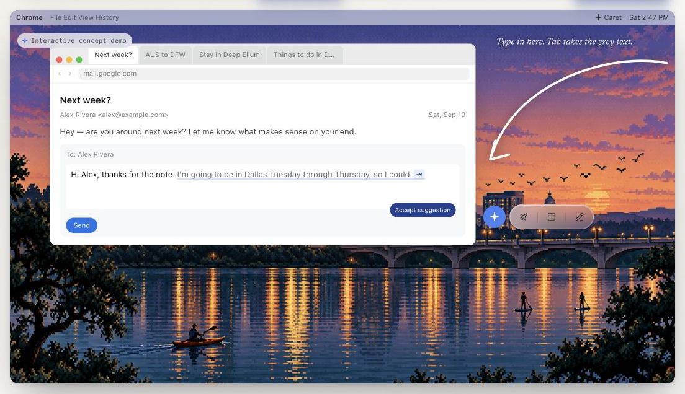
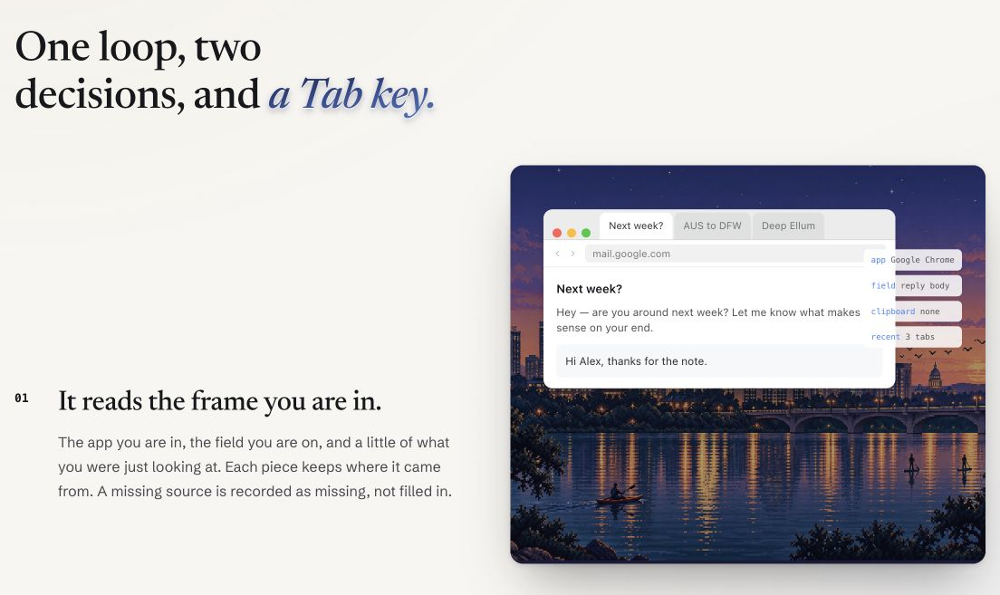
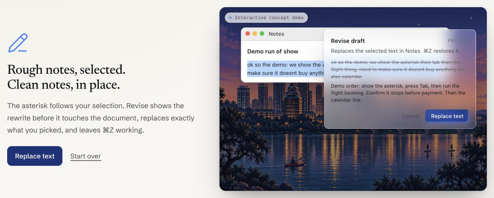
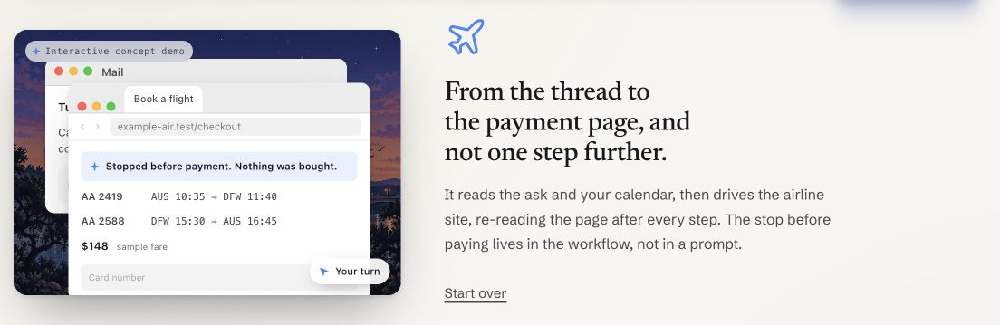

# Caret

[Visit the Caret site](https://caret-landing-ebon.vercel.app/)

A native Mac assistant with two interaction modes: inline completion accepted with Tab, and a nearby action hoverable. Jev chooses whether to abstain, offer a small text edit or propose an action; a second query selects the workflow or computer task. A fast Groq-hosted model generates inline text. The [input pipeline contract](docs/input-pipeline.md) is the source of truth; integration is still in progress.

## Jev decision router

Caret does not run actions from ambient context alone. A shared judge runs on a ~2s cadence while you work:

1. **Route** — `ABSTAIN`, `INLINE`, or `ACTION` from the current frame (focused field, clipboard, and whatever history the app attached).
2. **Workflow** — only if the route is `ACTION`: pick one registered workflow (or none).

Code owns cadence, validation, and execution. You accept before anything runs (Tab for inline text; Command–1/2/3 for visible action offers when the panel shows them). Wire format: [bridge-protocol.md](docs/bridge-protocol.md). Python entry point: `python3 -m caret.bridge`.

The product judge is [TypeSafe Jev](https://docs.typesafe.ai/introduction) (`TYPESAFE_API_KEY`, `--judge jev`). The Mac app defaults to `--judge pattern` so the loop works without a key; swap to `jev` in `~/.config/caret/dev.json` when you have one.

## From the site

Frames from the [interactive landing page](https://caret-landing-ebon.vercel.app/). These are browser demos with synthetic data, not recordings of the native app or live account actions.

### Complete a reply in context



### Read the current frame



### Preview a rewrite



### Stop before payment



### Propose meeting times


## Start here

The starter needs Python 3.11+ and macOS 14+. `make app` requires full Xcode; SwiftPM checks can use the Command Line Tools. The local core has no third-party Python dependencies. The selected native executor uses Go 1.26 and a Swift worker when integrated; upstream services have separate setup requirements.

```sh
git clone https://github.com/theodorexli/hackathon-2026-09-19.git
cd hackathon-2026-09-19
git submodule update --init --depth 1 packages/keytype
make test
make demo
make install    # Release Caret.app → /Applications
make dmg        # writes dist/Caret.dmg locally (gitignored)
```

**Prebuilt DMG (no Xcode):** open [GitHub Releases](https://github.com/theodorexli/hackathon-2026-09-19/releases), download `Caret.dmg`, drag Caret into Applications. The build is ad-hoc signed (not notarized). If macOS says Caret is “damaged,” clear the download quarantine, then open again:

```sh
xattr -dr com.apple.quarantine /Applications/Caret.app
open /Applications/Caret.app
```

Gateway skills and Tab completions that call the Python core still need a clone of this repo and `~/.config/caret/dev.json` with `"root"` set to that path (or `CARET_PROJECT_ROOT`). Notes and skills seed from the app bundle into Application Support on first run.

Maintainers: push a tag `v*` or run the **Release Caret.dmg** workflow (Actions → workflow_dispatch) to upload a fresh `Caret.dmg` to Releases.

Caret.app starts pinned Screenpipe 0.4.50 on port 3031 (clipboard history on) when that port is free. It resolves the published `screenpipe` binary and bootstraps a Caret-owned launchd job (`dev.caret.hackathon.screenpipe`) so the recorder is not a Caret child. If the port is already taken, it does not start a second recorder. It writes `.local/screenpipe-lease.json` only after `/health` reports the pin version — for a job Caret started, or for an existing matching listener (lease `pid` 0). A listener that is not that pin gets no lease. The built app Info.plist carries `CaretProjectRoot` so the supervisor, skills, memories, and notes can find this repository. `python3 -m caret` can then ask for last-N windows, minutes, or clipboard, newest first. The Caret menu Debug item shows a short last-2 windows / minutes / clipboard preview of what Caret currently sees.

The app asks for Accessibility, then shows a blue asterisk beside supported fields and selections. Command–Option opens the action panel; pinned skills use Command–Option–1/2/3. **Caret.app** launches a Python core over the bridge for inline routing and Jev-prepared action offers; Tab completions and gateway writing skills use the same repo via `~/.config/caret/dev.json`.

## Status (honest)

**Works today**

- Native shell: focus/selection capture, Screenpipe sidecar on the pin port, permission onboarding, DMG install.
- Python core + tests: two-step judge, router cadence, workflow registry, `make demo` on synthetic meeting fixtures.
- Mac ↔ `caret.bridge`: context updates, inline offers, ambient action offers, acceptance → sample workflows (e.g. local meeting holds, draft-only meeting adapter, opt-in `jev-scheduler` sample).

**Still open**

- Live **Jev** as the default app judge (pattern demo stand-in today).
- Full **Screenpipe history** in every judge frame (Debug preview exists; routing context is thinner than the contract).
- **Gmail, Calendar send, Skyvern, live browser checkout** — documented in [integrations.md](docs/integrations.md), not product-complete.
- No payment, no invented travel or availability; fixture and sample data cannot be sent as real mail.

**This is a contributor starter, not a finished product demo.** `make demo` exercises the planner only. The app cannot send email, create external calendar events, or purchase anything.

## Where to work

| Component | Location | First integration |
| --- | --- | --- |
| Mac input UI | `Caret.xcodeproj`, `apps/mac` | Teddy: inline text, action hoverable, scoped shortcuts and permission polish |
| Workflows | `caret/workflows.json`, `caret/planner.py` | Connect Jev routing and source-backed parameter extraction |
| History and run state | `packages/screenpipe`, `caret/store.py` | Context owner: Screenpipe retrieval; workflow owner: external effect IDs |
| Computer use | `packages/computer-use-jev`, `packages/skyvern` | Native AX execution and browser execution, respectively; stop before payment |
| Gmail and calendar | `docs/integrations.md` | Implement the documented source and action contracts |
| Jev scheduler demo (Vercel) | `jev-scheduler` | Sample thread + synthetic computer history through Jev; verified options, tentative holds, draft. See its README for quick start, architecture, provenance and limits |
| Landing site | `sites/landing` | Static showcase with interactive sample workflows; maintained in its own repository |

The Python CLI also exposes JSON preview/hold/confirm for labeled fixtures (`python3 -m caret preview`). There is no server, container or web frontend in the default run. SQLite data stays in ignored `.local/` files. `python3 -m caret workflows` lists the seeds.

## Public repositories

Five selected repositories are pinned under `packages/`: KeyType and GhostType for one combined text interaction, Computer Use Jev for native actions, Skyvern for browser control and Screenpipe for history. Pins and roles live in [sources.json](sources.json). Alternative engines were removed so agents have one clear implementation path.

Fetch only what you need:

```sh
make sources   # KeyType, GhostType and the selected native Jev pipeline
git submodule update --init --depth 1 packages/skyvern
git submodule update --init --depth 1 packages/screenpipe
```

`git submodule update --init --depth 1` fetches all top-level sources. Avoid `--recursive` unless you need an upstream's dependencies. Nothing automatically installs or runs upstream code. Read each upstream's own setup instructions before running it. Make changes to Caret outside submodules unless your team intentionally maintains an upstream fork.

Screenpipe retains its historical MIT pin, whose grant excludes `ee/`; coordinate any change with its owner. Skyvern has AGPL terms. The root license applies only to original Caret files. See [THIRD_PARTY.md](THIRD_PARTY.md).

## Demo target (Austin–Dallas)

Start with the Austin–Dallas corridor. Before the live demo, connect one reliable travel source or check in a sourced, dated cached timetable. The current synthetic buffer fixture is **not** a timetable and must not be used as factual travel evidence.

Open a real thread, invoke Caret, and inspect its filled request. Enter produces up to three supported options and evidence. Sending the approved draft creates tentative calendar holds. A labeled staged reply selects one option; one confirmation keeps it and removes only this workflow's other holds. The booking workflow uses the browser and stops at the payment page.

Drop options when source calls fail. Never ask a model to invent missing availability, travel times or fares. Do not add multi-party polling, hotel search or ticket purchases to this build. The three seeds are Book a flight, Book a calendar link and Revise; only meeting previews currently execute.

## Landing site

The first-party landing page is a separate Git submodule at `sites/landing`. Its browser demos use sample data and do not call the native app or external accounts.

```sh
git submodule update --init sites/landing
cd sites/landing
npm ci
npm run dev
# npm run build writes the static site to dist/
```

## Checks

`make check` runs the scheduling/store tests, verifies submodule pins and builds the Mac executable. CI runs the Python suite and manifest check on Linux, and the Swift build on macOS. No check uses live accounts or sends messages.

Read [CONTRIBUTING.md](CONTRIBUTING.md) before changing shared contracts.
