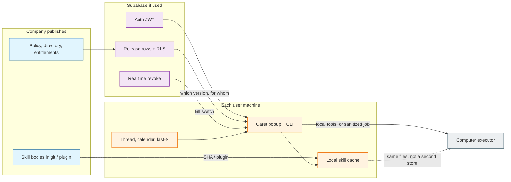

# Architecture Decision: Supabase Benefit With Local Caret and Computer

Standalone creative (2026-09-19). Does not change `caret-pinned-screenpipe`. Open question: given Caret on every user machine, Computer as the executor, and skill definitions published by us as the company, what does Supabase actually do that helps?

## Requirements and Constraints

Functional:

- Each user runs Caret locally (Swift popup + `python3 -m caret`). Execution and evidence stay on that machine unless we deliberately send a packet elsewhere.
- We are going to Computer: a browser/desktop executor that is not the Caret process. That may be Cursor Cloud Agents with computer use, or a local Jev/Skyvern path. Either way, Computer is not Supabase.
- Skill definitions are published by us (the company) and pulled onto each machine. A skill is a versioned package (`SKILL.md` plus optional scripts/references), not a database row of prose.
- Company facts that skills *read* (travel policy, approved vendors, home airport, who may book) are different from the skill files that teach *how* to book.

Quality attributes, ranked for this topology:

1. Honesty / privacy — personal threads, last-N history, tokens, and screenshots stay on the laptop. A company server must not become a second Screenpipe.
2. Fitness — the company can publish, version, entitle, and revoke what each Caret install offers, without standing up a custom app server.
3. Simplicity — do not add a backend that git or Cursor's team marketplace already is.
4. Maintainability — one source of skill *bodies*; Caret and Computer must not drift into two copies of the same markdown.
5. Scale — a hackathon and a small company fleet. Not a multi-tenant marketplace.

Technical constraints:

- Caret today is two processes and no server. Run state is local SQLite. Python has an empty third-party dependency list.
- Live credentials and personal data stay out of Git. The same rule applies to any hosted database.
- Agent Skills are files, discovered from disk or from a Cursor plugin. Official surface: [Cursor skills](https://cursor.com/docs/skills), [Agent Skills](https://agentskills.io).
- Cursor already distributes company skills as plugins through a team marketplace ([plugins](https://cursor.com/docs/plugins)). Cloud Agents do not see unsynced `~/.cursor/skills/` unless the user syncs or the skill is in the repo / a published plugin.
- Supabase is Postgres plus Auth (JWT + [RLS](https://supabase.com/docs/guides/auth/row-level-security)), auto REST via PostgREST, Realtime, Storage, and Edge Functions. Official map: [architecture](https://supabase.com/docs/guides/getting-started/architecture).
- CI already has `SUPABASE_HACKATHON_TOKEN`. That is a capability, not a reason to upload desktop history.

In scope: which Supabase products (if any) earn a place in this topology, and where the company-hosted boundary sits.

Out of scope: implementing a catalog, choosing Jev vs Skyvern vs Cursor Computer, Screenpipe launch, adding a Python Supabase client to the starter.

## Components

Single responsibilities:

- **Git / Cursor plugin** — skill *bodies*. How to do the work. Versioned like code.
- **Supabase** — who this install is, which releases they may pull, whether a release is live, and structured company nouns skills query. Not the executor. Not the gatherer.
- **Caret** — local UI, local evidence, local pull/cache, local gates (times, money, stop-before-payment).
- **Computer** — drive a browser or desktop. Reads the same skill files Caret cached, or a Cursor-native copy of those files. Does not phone Supabase for every click.
- **Now** — thread, calendar, Screenpipe last-N. Never a Supabase table.

Communication: Caret talks to Supabase over HTTPS with a user JWT (request/response). Kill-switch may be a Realtime row change. Computer is either in-process/local or a remote VM; if remote, the only company-hosted payload is a sanitized job packet, not a screen stream.

## Options Evaluated

- **A. No Supabase**: Company catalog is a git repo and/or Cursor team marketplace. Caret ships or clones `workflows.json` / `SKILL.md`. Computer uses the plugin. Matches current “two processes, no server.”
- **B. Control plane, files stay files**: Auth + a small `skill_releases` (and optional company-facts) schema. Bodies stay in git. Caret pulls metadata, then fetches the SHA it was told to use. Realtime only for revoke. Conflicts with today’s “no server” only at the pull/login edge.
- **C. Supabase as the skill blob store**: `SKILL.md` text in rows or Storage is the source of truth. PostgREST becomes the company CDN for markdown. Conflicts with Agent Skills being version-controlled files and with Cursor’s plugin distribution.
- **D. Supabase as runtime and sync**: Runs, holds, frames, and mail excerpts live in Postgres so Computer or a dashboard can see them. Conflicts with privacy rank 1 and with local SQLite already being the run store.

## Analysis

| Criterion | A. Git / marketplace only | B. Control plane | C. Blob store | D. Runtime sync |
| --- | --- | --- | --- | --- |
| Privacy | Best. Nothing leaves unless git is public | Good if only metadata + company facts leave | Good if only published files leave | Fail. Desktop and thread become hosted |
| Fitness | Enough if one pack for everyone and Cursor already distributes it | Fits Caret-owned actions, per-team entitle, instant revoke | Fits “host files” only. Duplicates git | Fits a remote Computer that cannot see the laptop — at the cost of uploading “now” |
| Simplicity | Wins if no entitlements | One hosted project, no custom API (PostgREST). Extra moving part | Looks simple, then you reinvent PRs, review, and diffs | New product: cloud Caret |
| Two runtimes | Cursor marketplace covers Computer; Caret still needs its own pull or a clone | Metadata shared; both runtimes pin the same git SHA | Both runtimes fetch markdown from us; Cursor plugins become a fork | Computer reads our cloud copy of the user’s life |
| Risk | We outgrow “everyone gets the same plugin” | We build a plane nobody queries | Skill source of truth splits from git | Hard to undo; violates starter constraints |

Key insights:

- Supabase is not one product. The useful slice here is **Auth + RLS + a few tables + optional Realtime**. Storage, Edge Functions, and pgvector do not earn a seat on day one. Architecture: [Supabase architecture](https://supabase.com/docs/guides/getting-started/architecture).
- Skill definitions are already a solved distribution problem for Cursor ([skills](https://cursor.com/docs/skills), [plugins](https://cursor.com/docs/plugins)). Re-hosting `SKILL.md` in Postgres is a worse git.
- Caret is not Cursor. The popup’s action list (`workflows.json`, pinned actions) is a Caret catalog. Cursor’s marketplace will not fill it. That is the hole a thin control plane can fill without becoming a skill CMS.
- Company *facts* (policy, directory, “this person may book”) are relational and access-scoped. That is what Postgres and RLS are for. Company *procedures* are files.
- Remote Computer cannot see Mail.app or last-N. The honest designs are: keep Computer on the laptop, or send a sanitized job packet. Streaming the desktop to Supabase is not a third honest design.
- A hackathon token is not a product requirement. If the catalog is one pack for every install, option A is enough and Supabase stays unused.

## Decision

### Choice Pre-Mortem

- Computer is only Cursor Cloud Agents, and the company skill pack is one team plugin, so the control plane has no readers: checked. Then we do not stand up Supabase. The same boundary still holds: files in git, facts only if we later need them, never “now” in the cloud.
- We need per-team entitle or a kill switch, and we skip the plane, so a yanked skill stays live until every laptop pulls git: checked. That is the reason B exists. If we do not need yank/entitle, we stay on A.
- A later teammate uses Storage or Realtime to sync Screenpipe or mail “so Computer can see”: checked. Rank 1 forbids it. Computer gets skill files and, if remote, a packet we constructed — not a gatherer dump.

**Selected**: Option B when Caret must know *which* company skills this install may run, or when skills must read structured company facts. Option A when the company publishes one pack and Cursor already distributes it. Never C. Never D.

**Rationale**: Rank 1 knocks out D. Rank 3 knocks out C (git and Cursor plugins already host skill bodies). Rank 2 and 4 leave a narrow job that Supabase is actually good at: identity, entitlement, release metadata, and RLS-scoped company nouns — with PostgREST so we do not write an app server. That is the benefit. The rest of the Supabase brochure (Storage as CMS, Edge Functions as the agent, vectors over last-N) is not.

**Tradeoff**: We accept a login and a hosted project at the pull edge, or we accept that revoke is “wait for the next git pull.” We do not accept a second source of truth for `SKILL.md`, and we do not accept uploading the user’s now.

## Implementation Notes

- Treat skill bodies as Agent Skills in git. Caret’s pull writes a local cache. Computer uses the same files (local executor) or the same plugin/SHA (Cursor Computer). Do not store skill markdown in Postgres except perhaps a checksum and URI.
- If B is stood up, keep the schema tiny: `orgs`, `memberships`, `skill_releases(skill_id, git_sha, semver, enabled, audience)`, optional `company_facts`. Every user table uses RLS. Auth docs: [Supabase Auth](https://supabase.com/docs/guides/auth).
- Realtime is for “this release is now disabled,” not for frame streaming. [Realtime](https://supabase.com/docs/guides/realtime).
- Do not add a Python Supabase client until a later task actually pulls. The starter’s empty dependency list stays until then.
- Never send last-N, RFC 822 bodies, tokens, or screenshots to Supabase. A remote Computer job, if we ever add one, is a constructed preview: times, evidence excerpts the user already approved, stop-before-payment. Drop failed sources; do not invent.
- Cursor team marketplace remains the Computer-native distribution path. Supabase does not replace it. It answers questions marketplace does not: is this *Caret* install allowed to show `book-flight`, and what is this company’s travel policy.
- `SUPABASE_HACKATHON_TOKEN` is for CI against that project. Do not commit the value. Do not treat token presence as permission to sync personal data.
