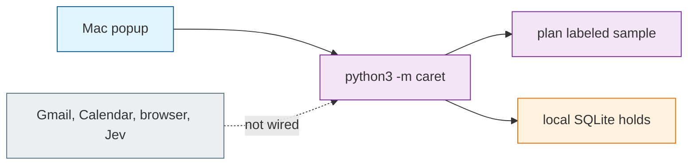

# System Patterns

## How This System Works

Caret is two processes and no server. A native Mac popup shells out to `python3 -m caret` with an argument array and reads JSON on stdout. The Python package is the workflow core: it plans from a labeled fixture, writes run records and local holds to SQLite under `.local/`, and prints the result. There is no HTTP frontend, no container, and no daemon between the popup and the core.

The load-bearing assumption: anything that is not labeled sample data is rejected. Fixture output cannot silently become a real email. Live adapters, when they exist, must be an explicit change to that gate — not a leftover fixture field.

`packages/` is research. Pins in `sources.json` are public repos the team may adopt; none of that code runs in the default starter. Changing a pin, a submodule SHA, or `.gitmodules` without the others fails the source check. Treat those trees as upstream: keep their names, licenses, and authorship.

Contributor instructions that already live in `AGENTS.md` (scope, fixtures, credentials, how to check) are not repeated here.

## Process boundary is the public contract

The Swift caller and the Python CLI share JSON field names. Discuss a field change before editing both sides. The Mac app currently decodes a preview shape (`run_id`, `subject`, `thread_body`, `options`, `draft`, `evidence`, `notice`) and drives `preview` / `hold` / `confirm`. Adding a server or in-process Python binding would be a different architecture than the one this starter ships.

## Sample data cannot become sendable

`plan()` requires `mode == "sample"`. The returned notice states that the draft cannot be sent and that holds are local only. The Send control in the popup is disabled. Removing that gate without a live adapter that verifies sources would let synthetic times look like a real offer.

## Failed sources are dropped, never filled in

A candidate without `status == "ok"` and a source is dropped. Overlaps after travel buffers are dropped. Duplicate start times are dropped. At most three remaining options are kept, earliest first. With no supported options, the draft is empty and no hold path should pretend otherwise. A model must not invent a missing time, fare, or timetable. Live calendar failure must abort planning, not become an empty busy list. The intended contracts for Gmail, Calendar, and computer-use live in `docs/integrations.md`; they are not implemented.

## Local holds are a rehearsal, not a calendar

SQLite stores a run's preview JSON and per-option rows (`tentative` / `confirmed` / `released`). Confirming one option releases the others **for that run only**. Retries must not send mail or delete another run's rows. Returned Google Calendar event IDs are a future field; they do not exist in the starter schema. Do not report that external holds exist after a local `hold` or `confirm`.

## Three workflow seeds, one local path

`caret/workflows.json` lists `book-flight`, `book-calendar-link`, and `revise`. Only `book-calendar-link` has a local preview implementation, and the planner hard-codes that workflow id. The other two are marked `adapter_required`. Which browser executor (Jev Ultrafast or Skyvern) or native-insert path (KeyType and related pins) the team will use is unspecified; both families are pinned for evaluation.

## Timestamps are offset-aware

Every interval the planner accepts must include a timezone offset. Naive datetimes are rejected. Equivalent instants in different offsets still conflict. Travel buffers are nonnegative integer minutes supplied by the caller; they are not measured travel times until a timetable adapter exists.
